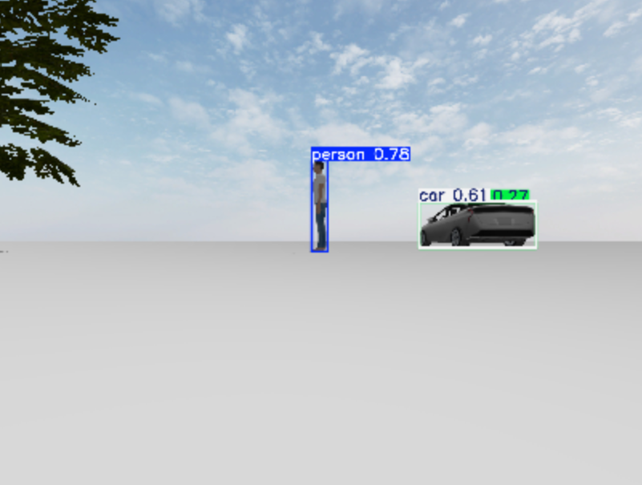

# Lecture 8 exercises

Tom Marti, repo link: [https://github.com/TomMarti/Lecture8-Exercise-DevOps-CPS](https://github.com/TomMarti/Lecture8-Exercise-DevOps-CPS)

This repo is based on a fork of: [https://github.com/erdemuysalx/px4-sim](https://github.com/erdemuysalx/px4-sim)

## Setup

1. First step is to build the different images.

```sh
chmod +x build.sh
bash build.sh --all
```

2. Start the container
```sh
docker compose up
```

3. Check for sanity

    1. Open a browser, navigate to [http://localhost:6080/vnc.html](http://localhost:6080/vnc.html), and connect to container with password 1234
    2. Open a shell in the container (`docker exec -it px4_sitl bash`)
    3. In the container run `cd /root/PX4-Autopilot`, then `make px4_sitl gz_x500`.

    The first time you run these command it may take a few minutes. At the end, you may see a quadcopter on the VNC window.

## Aufgabe 1

### Running each part
After launching the container

1. Run the world (in a new terminal)
```sh
docker exec -it px4_sitl bash
cd /root/PX4-Autopilot
PX4_GZ_WORLD=perception make px4_sitl gz_x500_mono_cam
```

2. Launch the Gazebo-Ros2 bridge (in a new terminal)
```sh
docker exec -it px4_sitl bash
ros2 run ros_gz_bridge parameter_bridge --ros-args -p config_file:=/root/config/gz_ros_bridge.yaml
```

3. Launch the detection node (in a new terminal)
```sh
docker exec -it px4_sitl bash
cd /root/ros2_ws
source /opt/ros/jazzy/setup.bash
source install/setup.bash
ros2 run perception_yolo yolo_node
```

4. View the annotated images (in a new terminal)
```sh
docker exec -it px4_sitl bash
ros2 run rqt_image_view rqt_image_view
```

5. On the VNC (http://localhost:6080/vnc.html) (password 1234), you have a little window you can use to visualize the annotated images.


### Work

The pipeline was assembled in three layers on top of the provided containerized environment:

#### Simulated world 
I build the world `worlds/perception.sdf` as a small scene containing two people, two cars, three trees, and a house. All models are included from the Fuel registry, so the world file stays tiny and models are downloaded on first launch. The file is binded into the container. 

#### Camera bridge
Simulated drone images are publish on a Gazebo topics which is not accessible by Ros2. In order to make it accessible, the `ros_gz_bridge` node republishes the image topic on `/drone/camera/image_raw`.

#### YOLO Node
A detectore node using the YOLO v8 model. It publish two things:
- `/perception/detections`, a custom message type `perception_msgs/DetectionArray` containing class names, class IDs, confidence values, and bounding boxes in pixel coordinates for every object detected in the frame.
- `/perception/image_annotated`, a `sensor_msgs/Image` with colored bounding boxes and labels drawn on top of the original frame, using Ultralytics' built-in `results.plot()` helper.

All Python dependencies (`ultralytics`, `numpy`, `cv_bridge`, `vision_msgs`) are baked into the image via `px4-sitl.Dockerfile`, so nothing needs to be installed on the host and the environment is fully reproducible.

To inspect the `/perception/image_annotated` can be opened in `rqt_image_view` to see the detector's output live. The YOLO node also logs FPS and per-frame inference latency to stdout every 5 seconds, which will be used for the formal performance analysis in the next iteration.

#### QGroundControl
Despite all the effort deployed to connect QGroundControl to my container and so control the drone, I abandonned after 2 hours of tries. My next idea to make the drone fly was to make a script. It has a few advantages, it enable the reproducibility of the fly and hopfully make the drone fly.

Because of the impossibility to make the drone fly, the video is meaningless, I prefere to include an screenshot of the annotated image instead.

### Results
#### Visually

_Output of topics `/perception/image_annotated`. Annotated image with a person and a car init. The tree is to partially in the image to be detected as a tree._

#### Performance
```
============================================================
YOLO inference summary
============================================================
Model          : yolov8n.pt
Device         : cpu
Frames         : 1113
Wall time      : 78.1 s
Throughput     : 14.26 FPS
Latency min    : 23.8 ms
Latency mean   : 40.1 ms
Latency median : 40.2 ms
Latency p95    : 47.2 ms
Latency p99    : 51.5 ms
Latency max    : 104.2 ms
============================================================
```

### Conclusion

> I believe the TA mentioned that we are free to complete either
> **Aufgabe 1** or **Aufgabe 2**, or both. I'm submitting Aufgabe 1.